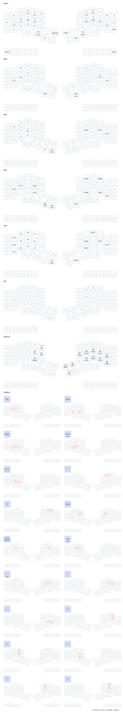

# Hands Down Promethium Keymap for Halcyon Kyria

The layout takes inspiration from these configs:

- [treeman](https://github.com/treeman/qmk_firmware/blob/a44a693ab6386c1a9e8836074081e53e08f8cf5a/keyboards/ferris/keymaps/treeman)
- [moutis](https://github.com/moutis/zmk-config/tree/main)
- [getreuer](https://github.com/getreuer/qmk-keymap)

